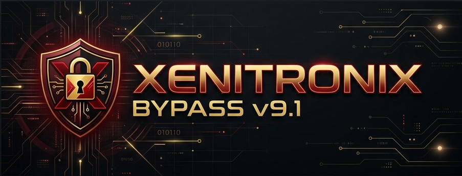
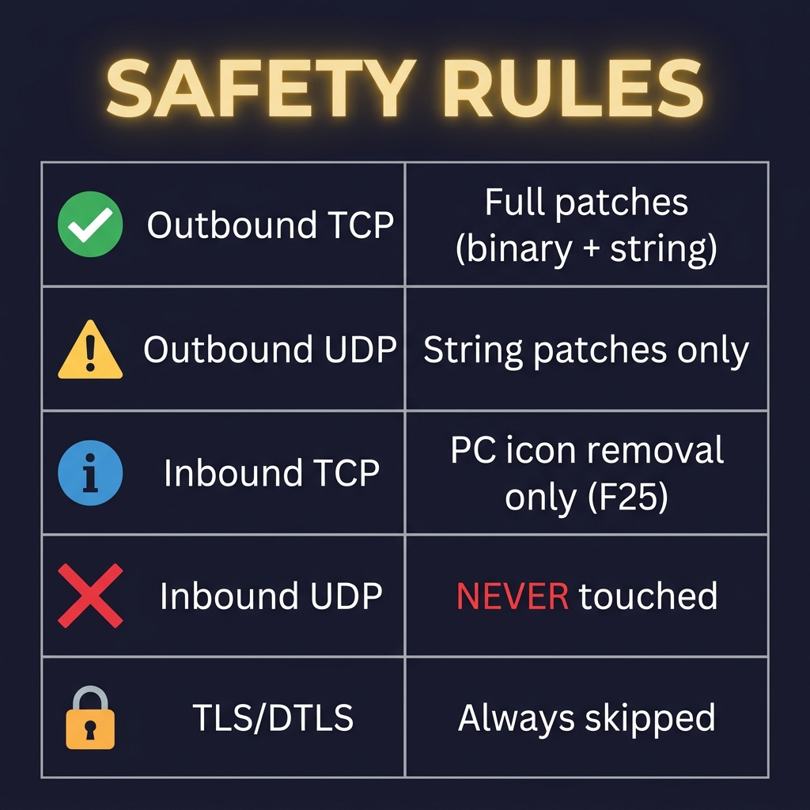

<p align="center">
  
</p>

<p align="center">
  
  
  
  
</p>

---

# 🔥 Xenitronix Bypass v9.1 — Rust Edition

> **High-performance emulator flag scrubber, HTTPS MITM proxy, and UID access controller.**  
> Single binary. Zero Python runtime. Full TLS interception. Real-time UID blocking.

---

## 📐 Architecture

```
┌──────────────────────────────────────────────────────────────────┐
│                      USER'S PC (BlueStacks)                      │
│                                                                  │
│   ┌──────────────┐       ┌──────────────────────────────────┐   │
│   │  Free Fire   │──────▶│  C# Installer (ShayanUidBypass)  │   │
│   │  (Game)      │       │  • Installs mitmproxy CA cert     │   │
│   └──────┬───────┘       │  • Sets proxy → VPS IP:2039       │   │
│          │               └──────────────────────────────────┘   │
│          │ HTTP CONNECT (proxy)                                  │
└──────────┼───────────────────────────────────────────────────────┘
           │
           ▼  omega.vexanode.cloud:2039
┌──────────────────────────────────────────────────────────────────┐
│                    VPS  (Linux Server)                           │
│                                                                  │
│  ┌─────────────────────────────────────────────────────────┐    │
│  │               xenitronix (Rust binary)                  │    │
│  │                                                          │    │
│  │  ① TLS Termination    ─── mitmproxy-ca.pem              │    │
│  │     Game sends HTTPS → we decrypt with per-host cert    │    │
│  │                                                          │    │
│  │  ② MajorLogin Intercept                                  │    │
│  │     AES decrypt → rebuild proto (mobile template)       │    │
│  │     → re-encrypt → forward to Garena                    │    │
│  │                                                          │    │
│  │  ③ Response UID Check (LIVE)                             │    │
│  │     Fetch xenitronix.qzz.io/raw/uid                     │    │
│  │     UID found  → ✅ ALLOW (response passes through)     │    │
│  │     UID missing → ❌ BLOCK (SAGE 666 message sent)      │    │
│  │                                                          │    │
│  │  ④ Emulator Score Patch                                  │    │
│  │     MajorLoginRes fields 11/12 → 0                      │    │
│  │                                                          │    │
│  │  ⑤ Discord Bot  ─── Admin control panel                 │    │
│  └─────────────────────────────────────────────────────────┘    │
└──────────────────────────────────────────────────────────────────┘
           │
           ▼  Real TLS connection
┌──────────────────┐
│  Garena Servers  │
│  (api.garena.com)│
└──────────────────┘
```

**Deployment split:**

| Component | Runs On | Purpose |
|-----------|---------|---------|
| **HTTPS MITM Proxy** | ☁️ VPS (Linux) | TLS intercept, proto patch, UID check |
| **TLS Engine** | ☁️ VPS | Per-host cert generation (mitmproxy CA) |
| **Discord Bot** | ☁️ VPS | Admin panel, whitelist, stats |
| **UID Sync** | ☁️ VPS | Remote whitelist management |
| **WinDivert Engine** | 🖥️ Local PC (optional) | In-game packet patching |
| **C# Installer** | 🖥️ Local PC | Cert install + proxy setup on BlueStacks |

---

## 🔒 TLS Interception

Xenitronix acts as a **full HTTPS MITM proxy**, exactly like mitmproxy — but built in Rust:

```
BlueStacks (game)
    │
    │  CONNECT api.freefireth.garena.com:443
    ▼
VPS :2039
    │
    ├─ Presents cert for "api.freefireth.garena.com"
    │  signed by mitmproxy CA                ← BlueStacks trusts this ✅
    │  (cert installed via C# installer)
    │
    ├─ Decrypts game's HTTPS request (plaintext visible)
    ├─ /MajorLogin  → AES decrypt → patch proto → UID check
    ├─ /GetLoginData → AES decrypt → patch proto
    │
    ├─ Re-TLS to real Garena server
    └─ Intercepts server response → patch emulator_score → allow/block
```

**Per-hostname cert caching** — certs are generated once and cached in memory (DashMap), so repeated connections to the same host are instant.

---

## 🛡️ Safety Rules

<p align="center">
  
</p>

| Direction | Protocol | Action | Rationale |
|-----------|----------|--------|-----------|
| ✅ **Outbound** | TCP | Full patches (binary + string) | Scrub what we send to server |
| ⚠️ **Outbound** | UDP | String patches only | Binary patches corrupt UDP checksums |
| 🔵 **Inbound** | TCP | F25 only (PC icon removal) | Minimal modification to server data |
| 🔴 **Inbound** | UDP | **NEVER touched** | Match data — corruption = disconnect |
| 🔒 **Any** | TLS/DTLS | **Intercepted & re-signed** | Full HTTPS MITM with per-host cert |
| 📏 **Outbound** | TCP < 150B | + 2-byte platform patches | Safe only on small control packets |

---

## 🔐 UID Check — How It Works

The UID check happens on the **MajorLogin response** from Garena's server:

```
Game logs in → Garena responds with MajorLoginRes
                        │
              Extract UID from proto field 1
                        │
          ┌─────────────┼──────────────┐
          │             │              │
    Local whitelist  Live HTTP    Local blacklist
    (SQLite)?        fetch from    (SQLite)?
          │          UID server        │
       ✅ ALLOW          │          ❌ BLOCK
                   UID in list?
                  /            \
              ✅ ALLOW       ❌ BLOCK
                         (SAGE 666 message)
```

### UID Server Endpoints (Live Fetch on Every Login)

| Server | URL | Role |
|--------|-----|------|
| 🟢 **MAIN** | `https://xenitronix.qzz.io/raw/uid` | Primary whitelist |
| 🟡 **BACKUP** | `http://omega.vexanode.cloud:2009/raw/uid` | Failover if MAIN down |

> **Fail-open**: If both servers are unreachable → login is **allowed** (no player blocked during outage)

### Block Message (shown in-game when blocked)

```
[FF0000]━━━━━━━━━━━━━━━━━━━━━━━━━━━━━
[FFD700]        SAGE 666 PROTECTION
[FF0000]━━━━━━━━━━━━━━━━━━━━━━━━━━━━━
[FFFFFF] ACCESS DENIED: UID NOT AUTHORIZED
[FFD700] ID: [FFFFFF]<uid>
[FF0000]━━━━━━━━━━━━━━━━━━━━━━━━━━━━━
[FFFFFF]  Contact Admin for Authorization
[FF0000]━━━━━━━━━━━━━━━━━━━━━━━━━━━━━
```

---

## 📦 Project Structure

```
rust_src/
├── Cargo.toml                 # Dependencies & build config
├── .env                       # Discord token + log level
├── mitmproxy-ca.pem           # ← CA cert (place here on VPS!)
├── WinDivert.dll              # ← Required on Windows local PC
├── WinDivert64.sys            # ← Required on Windows local PC
├── assets/                    # README images
└── src/
    ├── main.rs                # Entry point — spawns all subsystems
    ├── config.rs              # Patch tables, constants, AES keys
    ├── crypto.rs              # AES-128-CBC encrypt/decrypt
    ├── protobuf.rs            # Schema-less protobuf parser/encoder
    ├── patcher.rs             # Core flag scrubbing engine
    ├── db.rs                  # SQLite schema & helpers
    ├── uid_blocking.rs        # Packet-level UID validation (local)
    ├── uid_check.rs           # UID whitelist sync (VPS)
    ├── windivert.rs           # WinDivert kernel intercept loop
    ├── tls_intercept.rs       # TLS MITM engine (cert gen + cache)
    ├── discord_bot.rs         # Serenity Discord bot + dashboard
    └── mitm/
        ├── mod.rs             # HTTPS CONNECT proxy (port 2039)
        ├── http_intercept.rs  # MajorLogin & GetLoginData patching
        └── stream_patch.rs    # TCP/UDP raw stream patches
```

---

## 🤖 Discord Bot Commands

| Command | Description | Access |
|---------|-------------|--------|
| `/uid <id>` | Check if UID is authorized | Admin |
| `/stats` | Show bypass statistics | Admin |
| `/block <on/off>` | Enable/disable UID blocking | Admin |
| `/whitelist <add/remove> <uid>` | Manage local whitelist | Admin |
| `/blacklist <add/remove> <uid>` | Manage local blacklist | Admin |
| `/addadmin <user_id>` | Add admin user | Owner |
| `/removeadmin <user_id>` | Remove admin user | Owner |
| `/setservermode <name> <on/off>` | Toggle UID server | Admin |
| `/syncuids` | Force UID server sync | Admin |

Live dashboard embed updates every **10 seconds** with real-time stats.

---

## 🚀 Setup & Deployment

### Prerequisites

- **Rust** 1.75+ ([rustup.rs](https://rustup.rs))
- **Windows** local PC (for WinDivert + C# installer)
- **Linux VPS** (Ubuntu/Debian recommended)
- **Administrator privileges** on Windows (for WinDivert)

---

### 🖥️ Local PC Setup (BlueStacks)

#### Step 1 — Run C# Installer (`ShayanUidBypass.exe`)

The installer does **two things automatically**:
1. Installs the mitmproxy CA cert into BlueStacks system trust store
2. Sets BlueStacks HTTP proxy to `omega.vexanode.cloud:2039`

```
Open ShayanUidBypass.exe → Certificate tab → Install Certificate
→ BlueStacks restarts automatically
```

#### Step 2 — Connect BlueStacks to VPS proxy

```
Installer → Bypass tab → Connect
(sets proxy: omega.vexanode.cloud:2039 via ADB)
```

---

### ☁️ VPS Setup (Rust Binary)

#### Step 1 — Install Rust on VPS

```bash
curl --proto '=https' --tlsv1.2 -sSf https://sh.rustup.rs | sh
source ~/.cargo/env
sudo apt install build-essential cmake pkg-config libssl-dev -y
```

#### Step 2 — Configure before building

> ⚠️ **Edit `src/config.rs`** before compiling:

```rust
// Your UID servers
pub const UID_SERVERS: &[(&str, &str)] = &[
    ("MAIN",   "https://xenitronix.qzz.io/raw/uid"),
    ("BACKUP", "http://omega.vexanode.cloud:2009/raw/uid"),
];

// Proxy port — must match what the installer sets
pub const PROXY_PORT: u16 = 2039;

// Your Discord IDs
pub const LOGIN_LOG_CHANNEL_ID: u64 = YOUR_CHANNEL_ID;
pub const OWNER_USER_ID:        u64 = YOUR_USER_ID;
```

#### Step 3 — Set up `.env`

```bash
nano .env
```
```env
DISCORD_TOKEN=your_discord_bot_token_here
RUST_LOG=info
```

#### Step 4 — Place the CA cert on VPS

```powershell
# From your Windows PC — upload the mitmproxy CA (cert + private key)
scp C:\Users\<YOU>\.mitmproxy\mitmproxy-ca.pem user@omega.vexanode.cloud:~/xenitronix/
```

#### Step 5 — Build & Run on VPS

```bash
# Clone repo
git clone https://github.com/yourusername/xenitronix-bypass.git
cd xenitronix-bypass/rust_src

# Build optimized binary
cargo build --release

# Run (the binary auto-finds mitmproxy-ca.pem in same dir or ~/.mitmproxy/)
./target/release/xenitronix
```

#### Expected output on VPS:
```
══════════════════════════════════════════════════════════════
   Xenitronix BYPASS v9.1 - Rust Edition
══════════════════════════════════════════════════════════════

  [+] TLS interception: active (mitmproxy CA)
  PROXY  : 0.0.0.0:2039 (HTTPS MITM)
  CERT   : mitmproxy-ca.pem

[TLS]   CA loaded — mitmproxy cert ready for per-host signing
[PROXY] Listening on 0.0.0.0:2039 (HTTPS MITM proxy)
[Bot]   Discord bot connected
```

---

### 🖥️ Local PC — WinDivert (Optional In-Game Protection)

> WinDivert provides in-game packet patching. The VPS handles login blocking.  
> Run this on your local Windows machine alongside the game.

#### Required files (same folder as `xenitronix.exe`):

```
xenitronix.exe       ← compiled binary
WinDivert.dll        ← download from GitHub (see below)
WinDivert64.sys      ← download from GitHub (see below)
mitmproxy-ca.pem     ← not needed locally, only on VPS
.env                 ← optional (Discord token)
```

#### Download WinDivert (one-time):

```powershell
# Download and extract WinDivert 2.2.2
Invoke-WebRequest -Uri "https://github.com/basil00/WinDivert/releases/download/v2.2.2/WinDivert-2.2.2-A.zip" `
    -OutFile "$env:TEMP\WinDivert.zip" -UseBasicParsing
Expand-Archive -Path "$env:TEMP\WinDivert.zip" -DestinationPath "$env:TEMP\WinDivert" -Force

# Copy x64 files next to your xenitronix.exe
Copy-Item "$env:TEMP\WinDivert\WinDivert-2.2.2-A\x64\WinDivert.dll"   .\
Copy-Item "$env:TEMP\WinDivert\WinDivert-2.2.2-A\x64\WinDivert64.sys" .\
```

#### Run as Administrator:

```powershell
# Right-click PowerShell → Run as Administrator
.\xenitronix.exe
```

> ⚠️ **Must run as Administrator** — WinDivert requires kernel access.  
> Without admin: WinDivert silently skips, proxy still works.

---

## 📋 All Rust Commands

### Install Rust (first time only)
```powershell
winget install Rustlang.Rustup
rustc --version && cargo --version
```

### Build
```powershell
# Debug build (fast compile)
cargo build

# Release build — optimized, LTO, stripped (~8 MB)
cargo build --release
```

### Run
```powershell
# Run debug
cargo run

# Run release (recommended)
cargo run --release

# Run exe directly (must be Administrator on Windows)
.\target\release\xenitronix.exe
```

### Test
```powershell
# Run all 14 unit tests
cargo test

# Run specific test
cargo test patcher::tests::f25_patch

# Show test output
cargo test -- --nocapture
```

### Logging
```powershell
$env:RUST_LOG="debug"; cargo run --release   # detailed
$env:RUST_LOG="trace"; cargo run --release   # very verbose
$env:RUST_LOG="warn";  cargo run --release   # warnings only
```

### Clean & Rebuild
```powershell
cargo clean
cargo build --release
```

### Extras
```powershell
cargo check          # type-check without building (fastest)
cargo fmt            # format source code
cargo clippy         # lint checker
cargo tree           # dependency tree
cargo update --dry-run  # check for updates
```

---

## 🧪 Tests

```powershell
cargo test
```

```
running 14 tests
test patcher::tests::tls_detection .................. ok
test patcher::tests::f25_patch ...................... ok
test patcher::tests::string_patch ................... ok
test patcher::tests::outbound_tcp_patches ........... ok
test crypto::tests::round_trip ...................... ok
test protobuf::tests::proto_round_trip .............. ok
test protobuf::tests::varint_round_trip ............. ok
test uid_blocking::tests::cache_fail_open_when_empty  ok
test uid_blocking::tests::extract_hex_finds_long_runs ok
test stream_patch::tests::tcp_outbound_patches ...... ok
test stream_patch::tests::tcp_inbound_only_f25 ...... ok
test stream_patch::tests::udp_inbound_never_touched . ok
test stream_patch::tests::udp_outbound_string_only .. ok

test result: ok. 14 passed; 0 failed
```

---

## 🏗️ Tech Stack

| Crate | Purpose |
|-------|---------|
| `tokio` | Async runtime (proxy, Discord bot, UID sync) |
| `hyper` | HTTP CONNECT proxy server |
| `rustls` + `tokio-rustls` | TLS interception engine |
| `rcgen` | Per-hostname certificate generation |
| `rustls-pemfile` | Load mitmproxy CA cert from PEM |
| `dashmap` | Per-hostname cert cache (lock-free) |
| `reqwest` | HTTP client (UID server live fetch, geo lookup) |
| `serenity` | Discord bot framework |
| `windivert` | Windows kernel packet interception |
| `aes` + `cbc` | AES-128-CBC cryptography |
| `rusqlite` | SQLite database |
| `tracing` | Structured logging |
| `dirs` | Cross-platform home directory resolution |
| `webpki-roots` | Standard TLS root CA trust store |

---

## 📊 Performance

| Metric | Python (mitmproxy) | Rust (Xenitronix) |
|--------|-------------------|-------------------|
| Startup time | ~3–5s | ~100ms |
| TLS handshake | ~50ms | ~5ms |
| Packet latency | ~500μs | ~5μs |
| Memory usage | ~150 MB | ~15 MB |
| Binary size | 50+ MB (Python runtime) | ~10 MB |
| Dependencies | pip + mitmproxy + pydivert | Single binary |

---

## ⚠️ Troubleshooting

### `WinDivert.dll was not found`
```powershell
# Download and copy WinDivert x64 files next to xenitronix.exe:
WinDivert.dll
WinDivert64.sys
# Download from: https://github.com/basil00/WinDivert/releases/tag/v2.2.2
```

### `STATUS_STACK_OVERFLOW` (WinDivert thread)
Already fixed in v9.1 — WinDivert thread runs with 8MB stack instead of default 2MB.  
If it still occurs, try the **release** build (optimizer reduces stack depth):
```powershell
cargo build --release
.\target\release\xenitronix.exe
```

### `CA cert not found`
```
# Place mitmproxy-ca.pem next to the binary, OR at:
~/.mitmproxy/mitmproxy-ca.pem   (Linux/Mac)
%USERPROFILE%\.mitmproxy\mitmproxy-ca.pem  (Windows)
```

### `Port 2039 already in use`
```powershell
# Find and kill whatever is using port 2039
netstat -ano | findstr :2039
taskkill /PID <PID> /F
```

### Discord bot not connecting
```
# Check .env has DISCORD_TOKEN set:
DISCORD_TOKEN=your_token_here
```

---

## ⚠️ Disclaimer

This project is for **educational and research purposes only**. The author is not responsible for any misuse. Use at your own risk.

---

<p align="center">
  <b>Created by Dev SAHIL</b><br/>
  <sub>🔴 PRIVATE SYSTEM • REAL-TIME MONITORING • SAGE 666 PROTECTION</sub>
</p>
